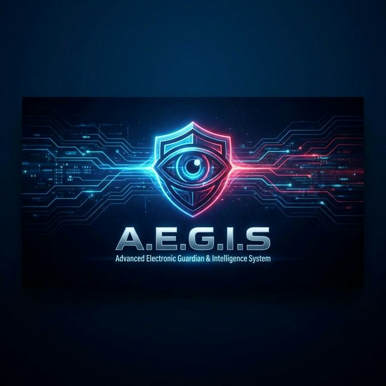

<div align="center">
  

  # A.E.G.I.S  
  **Advanced Electronic Guardian & Intelligence System**
  
  [](https://opensource.org/licenses/MIT)
  [](https://docs.trychroma.com/)
  [](https://ollama.ai/)
  []()
  []()

  > *Fully Local • Uncensored (Protocol 666) • Autonomous Multi-Agent Swarm*
</div>

---

## 🌌 Overview

**A.E.G.I.S** is a sophisticated, 100% offline, multi-agent AI system designed to operate as a local super-assistant. Running entirely on local hardware via Ollama, it ensures absolute privacy, unrestricted access, and limitless capability. 

With its advanced hybrid memory system (ChromaDB + SQLite) and permission-gated execution environment, AEGIS doesn't just answer questions—it **builds, researches, executes, and learns**.

### 🌟 Key Features

| Feature | Description |
|---|---|
| 🤖 **Multi-Agent Architecture** | 5 specialized AI agents (Orchestrator, Coder, Researcher, Tool Executor, Memory Manager) working in tandem via a message bus. |
| 🛡️ **Absolute Privacy** | 100% offline execution. No data is ever sent to OpenAI, Anthropic, or any cloud API. |
| 😈 **Protocol 666** | A togglable "Monster Mode" that unleashes the core LLMs, removing all alignment constraints, safety rails, and censorship for pure, raw, theoretical computation. |
| 🧬 **Hybrid Memory System** | RAG-powered long-term memory using ChromaDB for semantic search and SQLite for structured relational data. |
| ⚡ **MCP-Native Tools** | Full integration with the Model Context Protocol (MCP) for seamless interactions with IDEs like VSCode and Cursor. |
| 🧩 **ChatDev Integration** | Automated cloning and zero-configuration bridging to the incredible ChatDev software development orchestration framework. |

---

## 🛠️ System Requirements

To run AEGIS effectively without cloud support, your hardware must be capable of running local tensors.

- **RAM**: Minimum 16GB (32GB Recommended)
- **GPU**: 8GB+ VRAM (NVIDIA/AMD) required for real-time agent generation.
- **Storage**: ~20-30GB SDD space for the required LLM weights.
- **Software**: Windows OS, Python 3.11+, and [Ollama](https://ollama.ai/).

---

## 🚀 Installation & Quick Start

A.E.G.I.S features an automated setup script that pulls the required repositories, verifies your models, and seeds the databases.

```bash
# 1. Clone the repository
git clone https://github.com/desagencydes-rgb/A.E.G.I.S.git
cd A.E.G.I.S

# 2. Install Python dependencies via Poetry
poetry install

# 3. Run the automated initialization (This will clone ChatDev if missing)
poetry run python scripts/setup_chatdev_bridge.py
poetry run python scripts/setup.py

# 4. Pull the required core models
ollama pull hermes3:8b
ollama pull phi3:latest
```

### Starting the System

```bash
# Launch in Standard Guardian Mode
poetry run aegis

# Launch in Monster Mode (Unrestricted/Protocol 666)
poetry run aegis --mode monster
```

---

## 🏗️ Architecture & Agents

AEGIS is not a single chatbot. It is a swarm intelligence consisting of specialized nodes:

1. **The Orchestrator:** The brain. It parses user intent, breaks it down into workflows, and delegates tasks to the sub-agents.
2. **The Tool Executor:** The hands. It performs system-level I/O operations. It operates under a strict, 4-tier Permission System (SAFE, RISKY, DANGEROUS, FORBIDDEN).
3. **The Coding Agent:** The builder. Generates Python, React, and configuration files, constantly running TDD cycles.
4. **The Researcher:** The scout. Parses local files and documents to construct contextual awareness.
5. **The Memory Manager:** The hippocampus. Ingests all workflow data into ChromaDB to ensure the Orchestrator doesn't repeat past mistakes.

---

## 🔐 The Permission System

To ensure dangerous autonomous action doesn't wreck your local OS, the Tool Executor evaluates all commands:

- 🟢 **SAFE**: Read operations, file viewing, and isolated sandboxed tests run automatically.
- 🟡 **RISKY**: Modifying environment variables, installing packages requires explicit CLI `[y/N]` confirmation.
- 🔴 **DANGEROUS**: Deleting files or running destructive `.bat` scripts requires the immediate input of the hardcoded override phrase: `yesyesyes45`.
- ⚫ **FORBIDDEN**: Modifying Windows `System32` or the BIOS is permanently hardware-locked.

---

## 🔮 Future Plans & Roadmap

AEGIS is in active edge-development. The roadmap includes:

- [ ] **Vision Processing**: Integrating LLaVA/Vision models so AEGIS can analyze UI screenshots directly.
- [ ] **Cross-Device Swarm**: Allowing AEGIS to deploy lightweight worker agents to a secondary laptop or Raspberry Pi on the local network.
- [ ] **Advanced GUI**: Transitioning from a purely CLI-based output to a React/Next.js dynamic dashboard with live graphs of agent thoughts.
- [ ] **Code Self-Healing**: Setting up a cron job where AEGIS autonomously scans its own `.py` files and refactors technical debt overnight.

---

<div align="center">
  <b>Built by desagencydes-rgb | 100% Open Source | 100% Local</b><br>
  <i>"Don't stop. Just ensure you can undo."</i>
</div>
